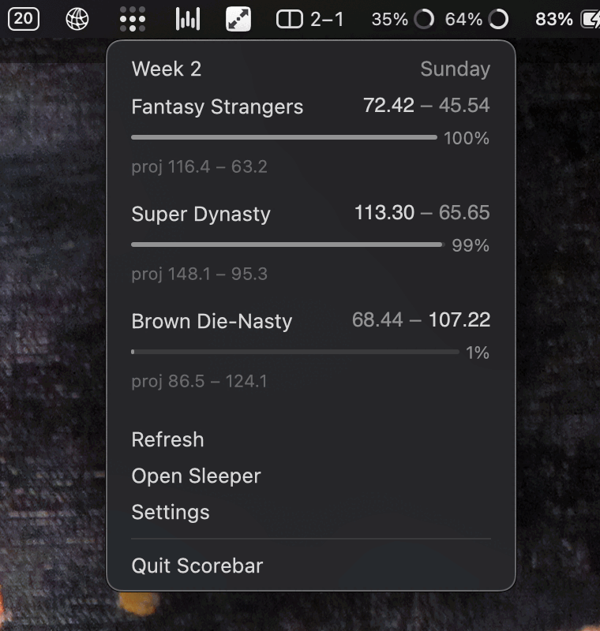

# scorebar

A macOS menu bar item for Sleeper fantasy football: the current week's score next to the clock, and
a popover with every league you are in, who is leading, and by how much.

Rust + [GPUI](https://www.gpui.rs/), sibling of
[claudebar](https://github.com/gautham-v/claudebar).



Give it your Sleeper username and it finds your leagues. The menu bar carries the one still in
doubt; the popover carries them all, each block a matchup with your score, theirs, and a meter of
your chance of winning it. Click a block and a window opens on the full head-to-head lineup, slot
by slot, with what each starter has scored and what they are still projected to.

Monochrome, one type size, no Dock icon, no login. Sleeper's read API is public, so a username is
all there is.

Not affiliated with, endorsed by, or connected to Sleeper. It reads Sleeper's public API the same
way a browser does.

## Install

```sh
brew install --cask gautham-v/tap/scorebar
```

macOS 13 Ventura or newer, Apple silicon or Intel. The cask installs one universal build, signed
with a Developer ID and notarized, so it opens without the "unidentified developer" detour.
`brew uninstall --cask scorebar` quits it and removes it; add `--zap` to take the config and the
cache with it.

Releases are cut by pushing a `v*` tag: `.github/workflows/release.yml` builds both architectures
into one binary, signs and notarizes it, publishes the release, and pushes the filled-in
`packaging/scorebar.rb` to the tap.

## From source

With a Rust toolchain (1.98 or newer) and Xcode installed:

```sh
make install   # builds Scorebar.app, copies it to /Applications, launches it
```

`make run` builds and launches from the cargo target directory instead, which is the one to use
while working on it. Both kill a running copy first.

## Settings

The **Settings** row in the popover, or `~/.config/scorebar/config.toml`:

| key | default | |
|---|---|---|
| `sleeper_username` | none | your Sleeper username, the one thing scorebar needs; without it the popover asks for it |
| `menu_bar_title` | `margin` | what the menu bar item prints beside the glyph: `margin` (how far ahead or behind the closest game is), `closest_game` (both scores), `record`, or `glyph_only`. A full score line is wide, and macOS hides a status item it has no room for rather than shrinking it, so the default is the short one. The popover carries every league either way |
| `refresh_seconds` | `60` | how often to refetch. Sleeper's cdn caches these endpoints for 60 seconds, so anything faster refetches the same numbers; the popover offers 1, 5 and 15 minutes and a hand-edited file is clamped to 15 seconds |

## Build

```sh
make test    # the workspace test suite, against recorded fixtures
make check   # fmt and clippy, the same gates CI runs
```

The tests never touch the network. The handful that do are `#[ignore]`d and run only on request:

```sh
cargo test --workspace -- --ignored
```

The popover can be worked on without a menu bar at all — this opens it in an ordinary window,
filled with invented leagues that cover the states worth looking at:

```sh
cargo run -p scorebar --example popover_preview
```


## Layout

| crate | what it is |
|---|---|
| `crates/sleeper` | the Sleeper read client: leagues, rosters, users, matchups, and the NFL state that says which week it is |
| `crates/core` | what a week looks like and what it is projected to look like: snapshots and win probability, plain arithmetic with no AppKit in it |
| `crates/app` | the menu bar app itself: the status item, the popover, settings, and the refresh loop |

`sleeper` and `core` build and test on any platform. Only `app` needs a Mac, which is why the three
are separate crates.

[docs/sleeper-api.md](docs/sleeper-api.md) is the endpoint-by-endpoint notes the client was written
from, including the parts of the API that are not documented upstream.
[docs/releasing.md](docs/releasing.md) is how a release is cut.

## How the data works

Sleeper's read API is public. There is no account to connect, no OAuth, and no API key: a username
is enough to find your leagues, and everything after that is public league data. scorebar keeps no
credentials, because it has none to keep.

Nothing leaves your machine except the requests to `api.sleeper.app`. There is no telemetry, no
analytics, and no third-party service in the path. scorebar writes `~/.config/scorebar/config.toml`
and a cache of what it last fetched in `~/Library/Caches/scorebar`.

### Win probability

Sleeper does not publish one. There is no such field in the REST API, and none in the GraphQL
schema either — 244 query fields, none of them a probability. Their app works it out client side,
and so does this one.

Each league's projections are scored with that league's own `scoring_settings`, which is what makes
a superflex half-PPR league project differently from a standard one. Then every starter who has not
scored yet is drawn from a distribution around their projection, 20,000 times, and the fraction of
those runs you win is the number in the meter.

Checked against Sleeper's own app on a live Sunday afternoon, it landed within two points on all
three leagues it was compared on. The one server-computed number Sleeper does have, `proj_points`
on `MatchupLeg`, needs a signed-in session, which is not something an app like this should be
asking you for.

### Fixtures

The fixtures under `crates/sleeper/tests/fixtures/` are captured from a real league and anonymized:
user ids, league ids, display names, team names and avatar hashes are synthetic. Player ids, NFL
team abbreviations and stat keys are real, because those are public reference data.

## Licence

MIT. See [LICENSE](LICENSE).
